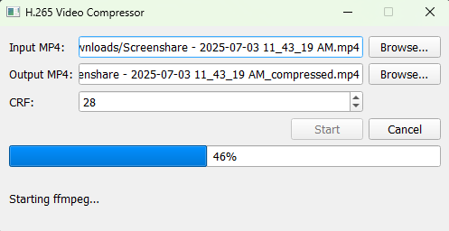

# CompressVideoGUI
## A GUI for compressing mp4 files
This GUI takes in mp4 files, automatically recommends an extension and compression rate, and outputs the compressed mp4 file in the same directory (unless specified). It just works.
